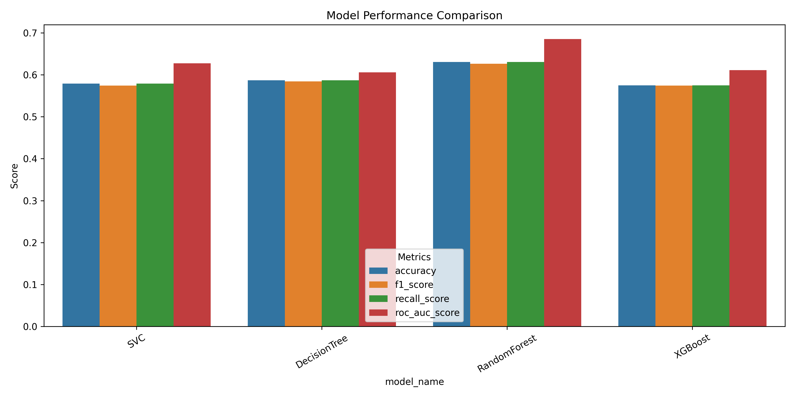
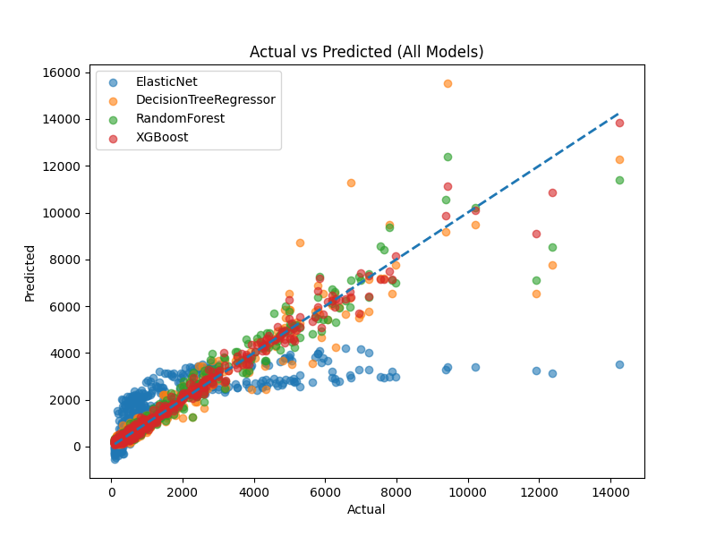

# *Service Provider Recommendation System*

[](https://www.python.org/)
[](https://github.com/Yashuu05/BasicRecommendationSystem/actions)
[](CONTRIBUTORS.md)

## 📋 Table of Contents

- [About](#about)

---

## About

- This project is an AI-powered service recommendation system that helps users find the best local technicians (e.g., laptop repair, WiFi setup, CCTV installation) based on their problem description.
- The system uses Natural Language Processing (NLP) to understand user queries and leverages Machine Learning models to:

1. Recommend the best service providers.
2. Predict estimated service cost.

---

## Problem Statement

- Finding reliable and efficient local service providers is challenging due to:

1. Lack of trust and transparency
2. No intelligent matching between problem and technician
3. Unclear pricing before service
4. Time-consuming manual search

---

## Proposed Solution

- This system provides an end-to-end intelligent pipeline:

1. User enters problem in natural language
2. NLP extracts structured features (issue, device, severity, urgency)
3. Price prediction model estimates service cost
4. Recommendation model ranks best providers
5. User receives top recommendations with estimated pricing

---

## Objectives

1. Build a multi-model AI system
2. Enable smart provider ranking
3. Provide cost transparency
4. Simulate a real-world startup MVP
5. Demonstrate end-to-end ML system design

---

## Project Structure

```
BasicRecommendationSystem/
│
|___ assets/   # images
|
├── data/
│   ├── raw/
|        |__ price_prediction_dataset.csv
|        |__ recommendation_dataset.csv
│   ├── processed/
|        |__ clean_price_prediction.csv
|        |__ clean_recommendation.csv
|
|__ models/
|      |__ PricePrediction/
|              |__ best_model.pkl
|      |__ Recommendation/
|              |__ best_model.pkl
|      |__ results/
|              |__ pric_prediction_result.csv
|              |__ price_performance.png
|              |__ recommendation_result.csv
|              |__ recommendation_preformance.png
|
|__ notebooks/
|
├── scripts/
|     |__ price_prediction_script.py
|     |__ run_full_pipeline.py
|     |__ service_recommend_script.py
|
├── src/
│   ├── config/
|   |      |__  __init__.py
|   |      |__ model_params.py
|   |
│   ├── data/
|   |      |__  __init__.py
|   |      |__  preprocessing.py
|   |      |__ price_prediction_clean.py
|   |      |__ recommendation_clean.py
|   |
│   ├── pipelines/
|   |      |__  __init__.py
|   |      |__ build_pipeline.py
|   |      |__ full_pipeline.py
|   |      |__ model_pipelines.py
|   |
│   ├── nlp/
|   |   |__  __init__.py
|   |   |__ constants.py
|   |   |__ nlp_extractor.py
|   |   |__ nlp_processor.py
|   |
│   └── utils/
|       |__  __init__.py
|       |__  data_utils.py
|       |__  model_utils.py
|       |__  ollama_chat.py
|
│__ static/
|__ templates/
├── requirements.txt
├── readme.md
|__ .gitignore
```

---

## Tech Stack

1. *Machine Learning*

- Scikit-learn

2. *Data Processing*

- pandas
- NumPy

3. *Model Optimization*

- GridSearchCV

4. *Backend (optional integration)* (in progress)

- Flask 

5. *Frontend* (in progress)

- HTML
- CSS

---

## Installation

1. Clone Repository

```
git clone https://github.com/Yashuu05/BasicRecommendationSystem.git
cd BasicRecommendationSystem
```

2. Install Dependencies

`pip install -r requirements.txt`

---

## Dataset Information

- Since real-world data was not available, synthetic datasets were generated.

## Recommendation Dataset

1. Features:
`issue`, `device`, `severity`, `urgent`, `rating`, `distance`, `success_rate`, `experience`

2. Target: `selected (0/1)`

## Price Prediction Dataset

1. Features:
`issue`, `device`, `severity`, `brand`, `urgency`, `device_age_years`, `service_type`, `city_tier`

2. Target: `price (INR)`

---

## Model Results / Performance

1. *Recommendation Model*



2. *Price Prediction Model*



#### Hyperparameters Used

1. Decision Tree Rgression

```
max_depth": [None, 10, 20, 30],
min_samples_split": [2, 5],
min_samples_leaf": [1, 2],
criterion": ["squared_error", "friedman_mse", "absolute_error", "poisson"]
```

2. Decision Tree Classification

```
max_depth": [None, 10, 20, 30],
min_samples_split": [2, 5],
min_samples_leaf": [1, 2],
criterion": ["gini", "entropy"],
max_features": [None, "sqrt", "log2"]
```

3. Random Forest Regression / classification

```
n_estimators": [100, 200, 300],
max_depth": [10, 20, 30, None],
min_samples_split": [2, 5],
min_samples_leaf": [1, 2],
max_features": ["sqrt", "log2"]
```

---

## Acknowledgement

- Scikit-learn documentation
- spaCy NLP library
- Open-source ML community
- Kaggle (for dataset inspiration)

## Machine Learning Algorithms used

1. *Classification* (service recommendation)

- [SVC](https://scikit-learn.org/stable/modules/generated/sklearn.svm.SVC.html)
- [DecisionTreeClassifier](https://scikit-learn.org/stable/modules/generated/sklearn.tree.DecisionTreeClassifier.html)
- [RandomForestClassifier](https://scikit-learn.org/stable/modules/generated/sklearn.ensemble.RandomForestClassifier.html)
- [XtremeBoostingClassifier](https://scikit-learn.org/stable/modules/generated/sklearn.ensemble.GradientBoostingRegressor.html)
  
2. *Regression* (Price Prediction)

- [ElasticNet](https://scikit-learn.org/stable/modules/generated/sklearn.linear_model.ElasticNet.html)
- [DecisionTreeRegressor](https://scikit-learn.org/stable/auto_examples/tree/plot_tree_regression.html)
- [RandomForestRegressor](https://scikit-learn.org/stable/modules/generated/sklearn.ensemble.RandomForestRegressor.html)
- [XGBRegressor](https://scikit-learn.org/stable/auto_examples/ensemble/plot_gradient_boosting_regression.html)

## Evaluation Metrics

1. *Classification*

- [Accuracy](https://scikit-learn.org/stable/modules/generated/sklearn.metrics.accuracy_score.html)
- [F1 score](https://scikit-learn.org/stable/modules/generated/sklearn.metrics.f1_score.html)
- [Recall score](https://scikit-learn.org/stable/modules/generated/sklearn.metrics.recall_score.html)
- [ROC_AUC score](https://scikit-learn.org/stable/modules/generated/sklearn.metrics.roc_auc_score.html)

2. *Regression*

- [MAE](https://scikit-learn.org/stable/modules/generated/sklearn.metrics.mean_absolute_error.html)
- [MSE](https://scikit-learn.org/stable/modules/generated/sklearn.metrics.mean_squared_error.html)
- [RMSE](https://scikit-learn.org/stable/modules/generated/sklearn.metrics.root_mean_squared_error.html)

---

### *status: Active*

---

### Comming soon. Work in progress.
